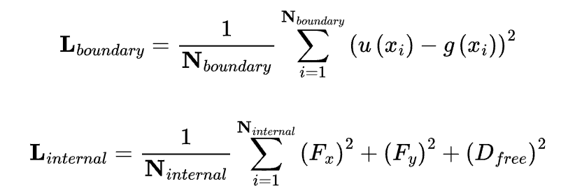

# PINN-2dNSEs
PINN for 2d NSEs test with lid driven cavity

**Navier Stokes Equations**

$$ \rho \left ( \partial_{t} \mathbf{v} +  \left ( \mathbf{v}  \cdot \bigtriangledown  \right ) \mathbf{v}  \right ) - \eta \bigtriangleup \mathbf{v} + \bigtriangledown \mathbf{p} = \mathbf{f} $$

in $\Omega$ $\times$ $\left ( 0, T \right )$,

$$ div \mathbf{v}  = 0 $$

in $\Omega$ $\times$ $\left ( 0, T \right ),$

$\mathbf{v} = \left ( u , v \right )$ is the velocity vector. $\mathrm{}{p}$ is the pressure. $\mathrm{\rho}$ is the density and $\mathrm{\eta}$ is the viscosity.

**Loss functions**

$$ F_x = \frac{\partial u}{\partial t} + u \frac{\partial u}{\partial x} + v \frac{\partial u}{\partial y} + \frac{1}{\rho} \frac{\partial p}{\partial x} - \nu \left(\frac{\partial^2 u}{\partial x^2} - \frac{\partial^2 u}{\partial y^2}\right) $$

$$ F_y = \frac{\partial v}{\partial t} + u \frac{\partial v}{\partial x} + v \frac{\partial v}{\partial y} + \frac{1}{\rho} \frac{\partial p}{\partial y} - \nu \left(\frac{\partial^2 v}{\partial x^2} - \frac{\partial^2 v}{\partial y^2}\right) $$

$$ D_{free} = \frac{\partial u}{\partial x} + \frac{\partial v}{\partial y} $$

**Test Result**
left side is the velocity field. right hand side is the pressure field.
